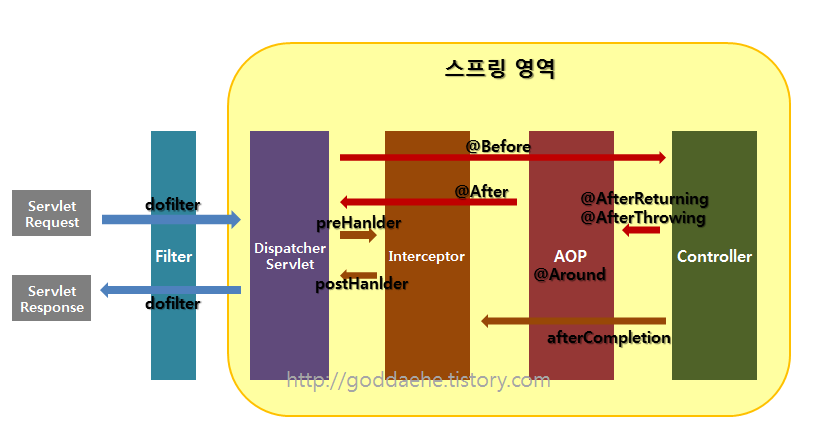

## Filter, Interceptor, AOP 

스프링 부트로 프로젝트를 진행 중 HTTP header, Token 유효성 검사 등 controller마다 중복코드가 생겼다.   
주로 웹 개발 시, 인증 처리, XSS로부터 보안 처리, 로깅 처리, 페이지 인코딩 등이 공통되는 부분이다.      
코드가 중복되면 소스 여러 군데 사용되며 관리가 힘들어지고, 늘어나는 소스양은 프로젝트 단위를 키우고 서버에 대한 부하, 유지 보수에 어려움을 겪게 된다.   
이러한 **공통 부분에 중복을 제거하고 한 곳에서 관리**하는 방법을 고민하였다.   
그 결과, 위 3가지 방법이 나왔다.   
<br/>
스프링에서 Filter, Interceptor, AOP 는 모두 **무슨 행동을 하기전에 먼저 실행**하거나, **실행한 후에 추가적인 행동**을 할 때 사용되는 기능들이다.   
<br/>
<br/>
### Filter, Interceptor, AOP 흐름


*출처: https://goddaehee.tistory.com/154 [갓대희의 작은공간]*
<br/>

- 요청이 들어오면 **Filter → Interceptor → AOP → Interceptor → Filter**(그림 화살표 방향 유의)
   1. 서버를 실행시켜 서블릿이 올라오는 동안에 init이 실행되고, 그 후 doFilter가 실행된다. 
   2. 컨트롤러에 들어가기 전 preHandler가 실행된다
   3. 컨트롤러에서 나와 postHandler, after Completion, doFilter 순으로 진행이 된다.
   4. 서블릿 종료 시 destroy가 실행된다.
   
- **Interceptor**와 **Filter**는 **Servlet 단위**에서 실행된다.   
반면 **AOP**는 메소드 앞에 **Proxy패턴**의 형태로 실행된다.
<br/>
<br/>

|항목|Filter|Interceptor|AOP|
|------|------|---|---|
|실행 위치|서블릿(Dispatcher Servlet 바깥)|서블릿(Dispatcher Servlet 안쪽)|메소드|
|설정 파일 위치|web.xml|xml or java|xml or java|
|스프링 자원 사용|X|O|O|
|적용 예|인코딩, XSS|로그인, 권한|트랜잭션, 로깅, 에러처리|
<br/>
<br/>

## Filter
서블릿 필터는 **DispatcherServlet 이전**에 실행이 되는데 필터가 동작하도록 지정된 자원의 앞단에서 요청내용을 변경하거나,  여러가지 체크를 수행할 수 있다.(spring 동작 순서 살펴보기)   
자원의 처리가 끝난 후 응답내용에 대해서도 변경하는 처리를 할 수가 있다.   
**스프링 context 외부에 존재**하여 스프링과 무관한 자원에 대해 동작   
   
보통 web.xml에 등록하고, 일반적으로 인코딩 변환 처리, XSS방어 등의 요청에 대한 처리로 사용   

필터의 실행 메서드
- init(): 필터 인스턴스 초기화
- doFilter(): 전/후 처리
- destroy(): 필터 인스턴스 종료
<br/>
<br/>
   
## Interceptor
interceptor는 **스프링 DispatcherServlet**이 **Controller를 호출하기 전, 후**에 실행된다.   
**스프링 context 내부**에서 Controller에 관한 요청과 응답에 대해 처리한다.   
스프링의 **모든 빈 객체에 접근가능**하다.   
   
여러개 사용 가능하고 로그인 체크, 권한체크, 프로그램 실행시간 계산 작업, 로그 확인 등의 업무 처리   
   
인터셉터의 실행 메서드
- preHandler(): 컨트롤러 메서드가 실행되기 전
- postHanler():컨트롤러 메서드 실행직 후 view페이지 렌더링 되기 전
- afterCompletion(): view페이지가 렌더링 되고 난 후
<br/>
<br/>
   
## AOP(따로 정리하기)
OOP 개념을 보완하기 위해 나온 개념    
종단면에서 바라보고 처리   
주로 '로깅', '트랜잭션', '에러 처리' 등 비즈니스단의 메서드에서 조금 더 세밀하게 조정하고 싶을 때 사용   
Interceptor나 Filter와는 달리 **메소드 전후의 지점에 자유롭게 설정**이 가능하다.   
    
**Interceptor와 Filter**는 **주소로 대상을 구분**해서 걸러내야하는 반면, **AOP**는 **주소, 파라미터, 애노테이션 등 다양한 방법으로 대상을 지정**할 수 있다.   
AOP의 Advice와 HandlerInterceptor의 가장 큰 차이는 **파라미터**의 차이다.   
Advice의 경우 JoinPoint나 ProceedingJoinPoint 등을 활용해서 호출한다.   
반면 HandlerInterceptor는 Filter와 유사하게 HttpServletRequest, HttpServletResponse를 파라미터로 사용한다.

**후에 코드로 차이 느끼기**   

### 추가할 것
> Q. 왜 AOP가 주소에 대상 지정이 가능한데 Interceptor를 사용할까?    
A.

<br/>
<br/>

## redteam Intercepter
Cors 관련 http 헤더와 jwt 유효성 검사를 intercepter를 통하여 구현
이슈: /** 대신 /* 을 사용하여 intercepter 적용안되는 바보같은..

### WebMvcConfigurer란 무엇인가?, 스프링에서는 무엇으로 구현되는가?

``` java
//Intercepter 클래스
@Component
public class HttpHeaderNJWTInterceptor implements HandlerInterceptor {

    @Override
    public boolean preHandle(HttpServletRequest request, HttpServletResponse response, Object handler)
    {
         //CORS 관련 Header
        response = setHeader(response);

        Cookie[] cookies = request.getCookies();
        Cookie cookie = null;
        
        if (cookies != null) {
            for (Cookie c : cookies) {

                try{
                    if (c.getName().equals("access-token")) {
                        TokenUtils.isValidToken(c.getValue());
                        return true;
                    }
                } catch (ExpiredJwtException e) {

                    try {
                        response.sendError(403, "token expired");
                        return false;
                    }catch(IOException ex){
                        ex.printStackTrace();
                        return false;
                    }
                } catch (JwtException e) {
                
         ...
                
        }catch(IOException ex){
            ex.printStackTrace();
            return false;
        }
    }

    public HttpServletResponse setHeader(HttpServletResponse response){
        SimpleDateFormat format = new SimpleDateFormat ( "yyyy-MM-dd HH:mm:ss");
        response.setHeader("Access-Control-Allow-Credentials", "true");
        response.setHeader("Access-Control-Allow-Origin", "http://localhost:8080");
        response.setHeader("Access-Control-Allow-Methods", "GET, POST, PUT, OPTIONS, DELETE");
        response.setHeader("Access-Control-Allow-Headers","Origin, X-Requested-With, Content-Type, Accept");
        response.setHeader("Cache-Control", "no-store, no-cache, must-revalidate, post-check=0, pre-check=0, max-age=0");
        response.setHeader("Last-Modified", format.format(new Date()));
        response.setHeader("Pragma", "no-cache");
        response.setHeader("Expires", "-1");

        return response;
    }
}

//Intercepter 설정 클래스 위와 분리
@Configuration
public class WebConfig implements WebMvcConfigurer {

    @Autowired
    HttpHeaderNJWTInterceptor httpHeaderNJWTInterceptor;

    @Override
    public void addInterceptors(InterceptorRegistry registry) {
        registry.addInterceptor(httpHeaderNJWTInterceptor)
                .addPathPatterns("/**");
    }

}
```

<br/>
<br/>

### 참고자료
- Filter, Interceptor, AOP 차이 및 개념   
https://goddaehee.tistory.com/154   
   
- Filter, Interceptor, AOP 차이   
https://velog.io/@sa833591/Spring-Filter-Interceptor-AOP-%EC%B0%A8%EC%9D%B4-yvmv4k96   
   
- Filter, Interceptor, AOP 코드와 설명   
https://offbyone.tistory.com/32   
